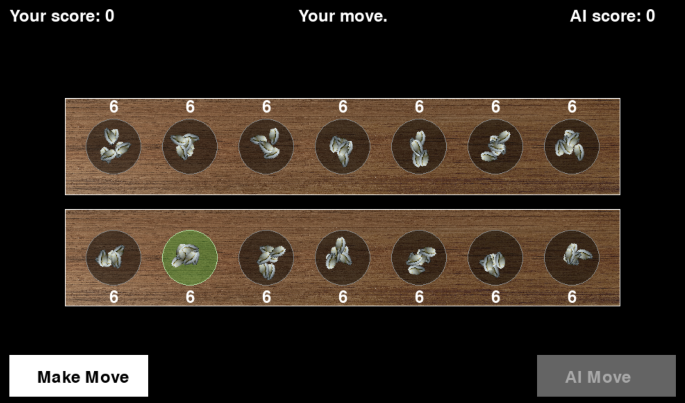

# Pallanguzhi.AI - Game

A digital recreation of the traditional South Indian game *Pallanguzhi*, built using Python and Pygame. This project combines interactive gameplay with AI decision-making, making the experience both engaging and challenging.

## Features

- Interactive graphical interface with pits and shells.
- AI opponent powered by a smart algorithm for optimal moves.
- Score tracking for both human and AI players.
- Real-time updates for moves and transitions.

## Sample Output

